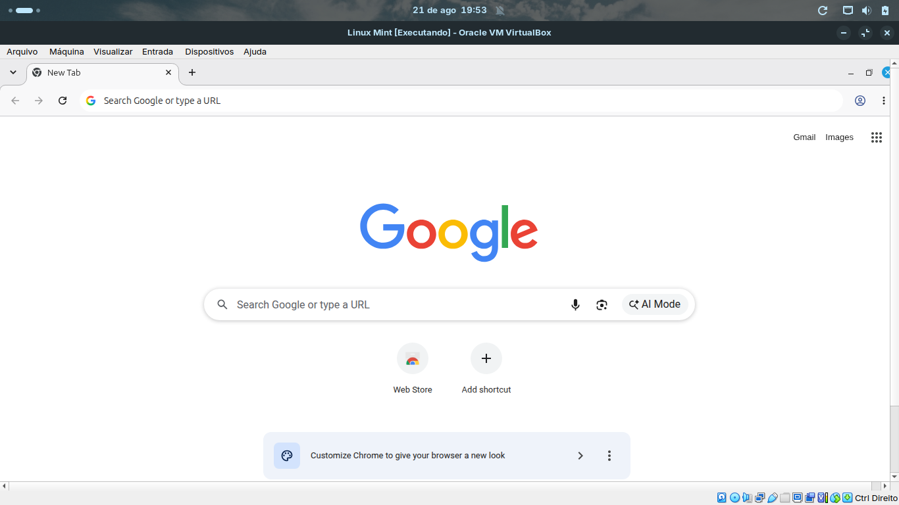
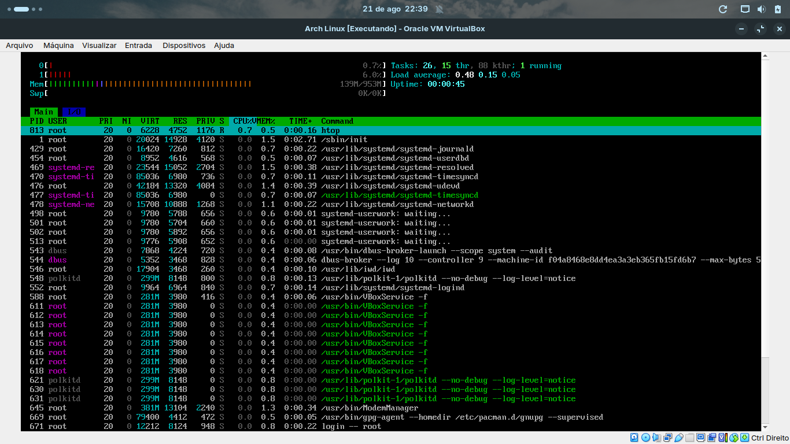

🐧 ISO Builder Web

Ferramenta web local para extração, modificação e reconstrução de imagens ISO Linux de forma simples e visual.

O projeto permite gerar ISOs personalizadas adicionando pacotes automaticamente (.deb ou pacotes Arch) e recriando a imagem bootável (BIOS + UEFI), preservando a estrutura de boot original.

Suporta tanto distribuições baseadas em **Debian/Ubuntu** (Ubuntu, Linux Mint, Debian, etc.) quanto **Arch Linux**.

✨ Demonstração

Interface web para gerar uma ISO personalizada:

Upload da ISO original
Inclusão de pacotes (.deb para Debian/Ubuntu, pacotes Arch para Arch Linux)
Barra de progresso em tempo real
Geração automática de ISO bootável

**Prova de funcionamento — pacote injetado, ISO gerada, boot confirmado:**

| Debian/Ubuntu (Linux Mint) | Arch Linux |
|---|---|
|  |  |
| Google Chrome injetado via `.deb` e já pré-instalado no boot da ISO gerada. O navegador nunca vem por padrão em nenhuma distro — a presença dele comprova que o pipeline de customização funcionou. | `htop` injetado via pacote Arch (`.pkg.tar.zst`) rodando normalmente após o boot, confirmando que a instalação via `pacman` dentro do chroot e a reconstrução da ISO preservaram um sistema íntegro e funcional. |

🚀 Funcionalidades

✔ Extração automática da ISO Linux via xorriso (com fallback para 7z)
✔ Detecção automática da distribuição (Debian/Ubuntu ou Arch) a partir da estrutura do SquashFS
✔ Customização do sistema via chroot, com o diretório de trabalho montado como ponto de montagem próprio (bind mount), evitando falhas de detecção de espaço em disco pelo pacman
✔ Instalação automática de pacotes (.deb via dpkg/apt, ou pacotes Arch via pacman)
✔ Reconstrução do SquashFS preservando a compressão original
✔ Geração de ISO bootável (BIOS + UEFI):
&nbsp;&nbsp;&nbsp;&nbsp;• Debian/Ubuntu: remontagem completa via xorriso -as mkisofs
&nbsp;&nbsp;&nbsp;&nbsp;• Arch: preservação do boot original via xorriso replay, sem reconstrução manual de MBR/GPT/El Torito/EFI
✔ Detecção automática do isohdpfx (Syslinux)
✔ Verificação segura de desmontagem do chroot (evita empacotar arquivos do sistema hospedeiro na ISO final)
✔ Limpeza de vestígios do host: reset de machine-id, remoção de locks residuais (dpkg/pacman) e restauração do DNS original do sistema Live
✔ Interface web com barra de progresso em tempo real

🧠 Como funciona

Pipeline simplificado:

1. Upload da ISO original
2. Extração do conteúdo da ISO (xorriso)
3. Detecção da distribuição (Debian/Ubuntu ou Arch) e do SquashFS
4. Extração do SquashFS e entrada em chroot para customização
5. Instalação de pacotes adicionais (opcional)
6. Reconstrução do SquashFS
7. Recriação da ISO bootável, preservando o boot original

Resultado → uma ISO Linux customizada pronta para instalar ou rodar em VM

🛠️ Tecnologias usadas

Backend

Python 3
Flask
SquashFS tools (mksquashfs / unsquashfs)
xorriso
7z (fallback de extração)
rsync
chroot

Frontend

HTML5
CSS3
JavaScript (Fetch API)

📋 Requisitos

Sistema operacional: Linux

Dependências do sistema:

```
sudo apt install squashfs-tools xorriso rsync syslinux-utils isolinux p7zip-full
```

> ⚠️ **Atenção:** o pacote `syslinux` sozinho **não** inclui o `isohdpfx.bin` (necessário para gerar ISOs híbridas BIOS/MBR). Esse arquivo vem no pacote separado `isolinux`. Se aparecer o erro `isohdpfx.bin não encontrado. Instale o pacote syslinux.` mesmo já tendo o `syslinux` instalado, rode `sudo apt install isolinux` separadamente.

Dependências Python:

Python 3.10+
pip

⚙️ Instalação

Clone o repositório:

```
git clone https://github.com/joaovitor10br/SiteDesmontagemISO.git
cd SiteDesmontagemISO
```

Crie o ambiente virtual:

```
cd backend
python -m venv venv
source venv/bin/activate
```

Instale as dependências:

```
pip install -r requirements.txt
```

▶️ Executando o projeto

O processo de criação de ISO precisa de permissões de root (manipula chroot e bind mounts), então o backend deve ser iniciado com sudo:

```
sudo ./venv/bin/python app.py
```

Abra no navegador:

```
http://127.0.0.1:5000
```

🧪 Testado com

Linux Mint 22.3 Xfce/Cinnamon (64-bit) — testado com injeção de pacote `.deb` (Google Chrome), boot validado no VirtualBox
Debian Live GNOME (64-bit) — testado com injeção de pacote `.deb` (Google Chrome), boot validado no VirtualBox
Arch Linux (ISO oficial 2026.08.01) — testado com injeção de pacote Arch (htop), boot validado no VirtualBox
VirtualBox / QEMU (BIOS e UEFI)

> ⚠️ Use a variante **Debian Live** (`debian-live-*-amd64-<ambiente>.iso`, disponível em [cdimage.debian.org](https://cdimage.debian.org/debian-cd/current-live/amd64/iso-hybrid/)), não a **netinst**/DVD de instalação — essa última é só o instalador (`debian-installer`) e não contém o `live/filesystem.squashfs` que o projeto espera encontrar.

📦 Estrutura do projeto

```
backend/
 ├── app.py
 ├── iso_linux.py
 └── requirements.txt

frontend/
 ├── index.html
 ├── sobre.html
 └── style.css

screenshots/
 ├── screenshot-mint-chrome.png
 └── screenshot-arch-htop.png
```

⚠️ Observações importantes

O projeto precisa rodar com permissões de root (via sudo) para manipular ISOs, montar filesystems e usar chroot.
Pode consumir bastante CPU/RAM/disco durante a extração e reconstrução da ISO (a ISO original é totalmente extraída em disco antes de ser remontada).
Ideal usar SSD para melhor desempenho.
Não use o mesmo diretório para armazenar a ISO de entrada e o diretório de saída/trabalho.

🎯 Objetivo do projeto

Este projeto foi desenvolvido com fins acadêmicos (Trabalho de Conclusão de Curso) para demonstrar:

Manipulação de imagens Linux (ISO9660, El Torito, SquashFS)
Automação de sistemas via chroot
Integração backend + frontend
Processos de build de distribuições Linux (Debian/Ubuntu e Arch)

👨‍💻 Autor

João Vitor Alves Martins

📄 Licença

Este projeto é de uso acadêmico.